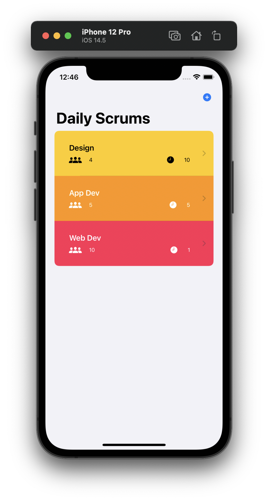
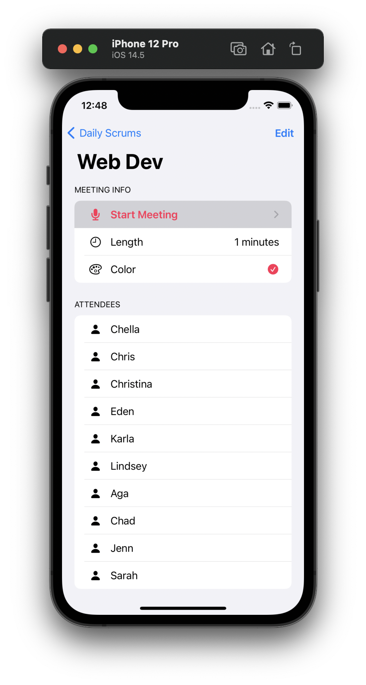
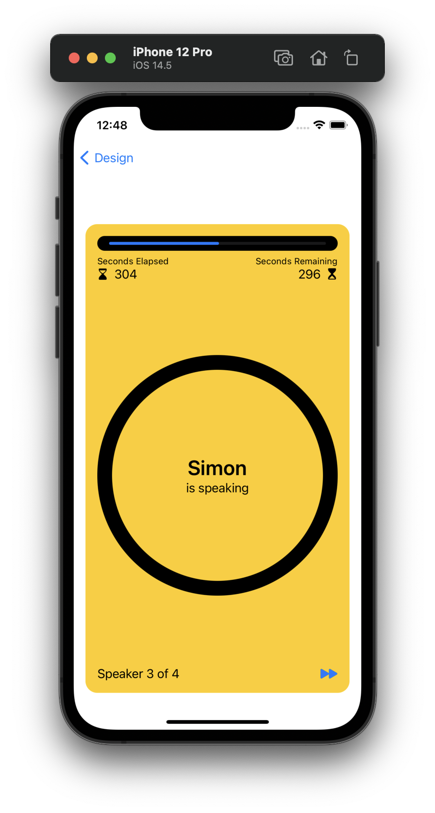
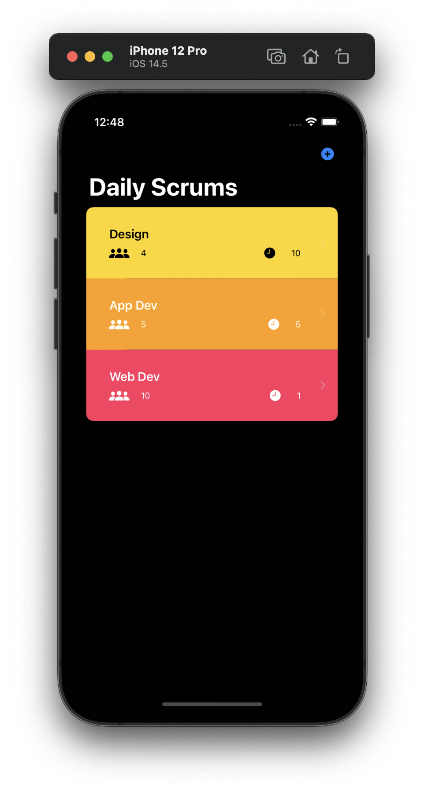

# Scrumdinger

An iOS app that helps users manage their daily scrums. To help keep scrums short and focused, Scrumdinger uses visual and audio cues to indicate when and how long each attendee should speak. The app also displays a progress screen that shows the time remaining in the meeting.

**Note:** Up to date for `iOS 14.1`, `Xcode 12.5` and higher.

 

         Main Screen                  Detail Screen                Meeting Screen                 Dark Mode

